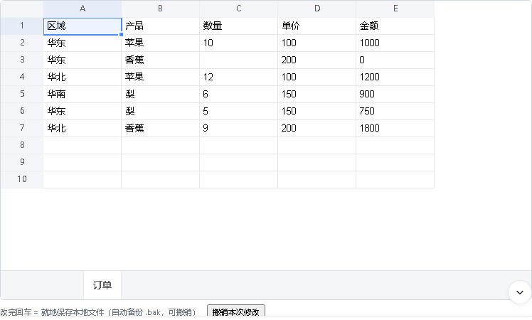
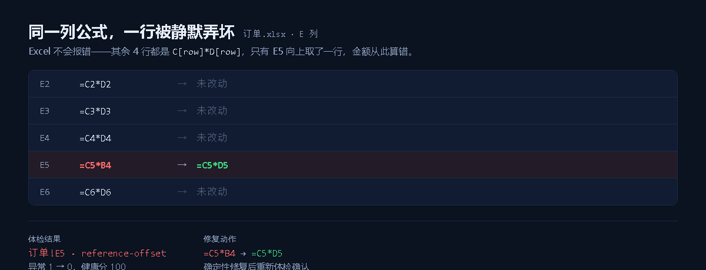

# dsh-excel-chat — talk to Excel, get the work done

**[简体中文](README.md) | English**

[](https://www.npmjs.com/package/dsh-excel-chat)
[](https://github.com/hccccc01333/dsh-excel-chat/releases)
[](LICENSE)


Work on Excel in plain language inside
[DeepSeek Harness](https://github.com/deepseek-ai/deepseek-harness): say "add a margin
formula in column D, bold the header, freeze the first row, add a filter" and the agent
calls `excel_operate` to do it. Every edit is followed by an automatic formula check, and
you can also ask it to "find what's wrong with this sheet" and repair it. Everything
happens in the conversation — there is no Excel UI to memorise.


## In action (real screenshots from the conversation)

| Capability menu: hand it a file, get options | Data insight: problems found for you |
| --- | --- |
|  |  |

| Table preview: a real grid inline | Formula check + auto-repair: the diff at a glance |
| --- | --- |
|  |  |

This one is **why you can let it touch your file**: one row of a formula column was silently
broken; it names the cell and fixes it. The cell, both formulas and the health score are the
engine's own output.



All four screenshots come from a real model calling the tools inside DeepSeek Harness Web,
rendered inline in the message stream: capability menu, issue list, editable table, and the
before/after repair diff.

## Architecture

```mermaid
flowchart LR
  U[User, plain language] --> H[DeepSeek Harness]
  H --> P["excel_profile / excel_read · structure overview / paged reads"]
  P --> M["excel_menu / excel_insight · capability menu / data insight"]
  M --> O["excel_operate / excel_task · operation DSL / multi-step / goal loop"]
  O --> V["excel_validate_formulas · formula check"]
  V -->|anomalies| R["excel_autofix / excel_repair_formulas · deterministic + LLM repair"]
  V -->|clean| OUT[Output workbook]
  R --> V2[Re-validate]
  V2 --> OUT
  OUT --> X["excel_explain_formula / excel_diff_workbook / excel_undo · explain / diff / rollback"]
```



The core loop is **understand → operate → verify → repair → re-verify → output**.
`excel_task`'s goal mode turns that loop into a **Plan → Act → Observe → Verify → Replan**
agent cycle.

## Install

```sh
dsh plugin --profile demo add dsh-excel-chat          # from npm
dsh plugin --profile demo add ./bundle                # or a local bundle directory
```

Run the self-check once after installing, to confirm the host package isolation and the
engine are fine:

```sh
dsh-excel-chat-doctor                                  # when installed globally / via npx
# or from inside the profile:
# ~/.dsh/profiles/demo/node_modules/.bin/dsh-excel-chat-doctor
```

Then just talk to it, for example:

> Turn report.xlsx into a report: column D is margin (revenue minus cost), add totals in
> column E, bold the header and fill it light grey, freeze the first row, add a filter.

> Check whether every row of column D in sales.xlsx is "revenue - cost", and fix the ones
> that aren't.

The full guide is in [docs/usage.md](docs/usage.md); role-specific recipes (operations,
product, data analysis) are in [docs/roles.md](docs/roles.md).

## For users: one-minute start

Requires DeepSeek Harness (the `dsh` CLI or the desktop app).

```sh
dsh plugin --profile demo add dsh-excel-chat      # from npm
# or from GitHub:
# dsh plugin --profile demo add github:hccccc01333/dsh-excel-chat
dsh web --profile demo                             # open the conversation UI
```

Then say:

- "Turn report.xlsx into a report: margin in column D, totals in column E, bold the header, freeze the first row, add a filter"
- "Check the formulas in column D of sales.xlsx and fix the wrong ones"
- "Build a pivot table by region summing the amount, then a bar chart"

Platform notes: formula checking and repair, reading and writing cells, styling, subtotals,
merges and mail merge work across platforms. Chart creation and editing, native pivot
tables, chart PNG export and PDF export need Windows with a local Excel install.

Pinning a version: `dsh plugin --profile demo add dsh-excel-chat@0.39.9` (omitting the
version gets `latest`).

Switching the output language (Chinese by default): every user-facing message follows it —
add an override to your profile's
`cordis.patch.yml` — `- id: vera` / `config:` / `language: en`. Only the *messages* are
translated; data inside the workbook (subtotal labels, generated sheet names) is not,
because code keys off it. See [docs/usage.md](docs/usage.md).

## Tools

| Tool | What it does |
|---|---|
| `excel_validate_formulas` | Silent formula error detection: column pattern drift, structure mismatches, hardcoded cells, empty gaps, circular references, and error values such as `#REF!` / `#DIV/0!` |
| `excel_compile_formula` | Formula IR (binary / ratio / aggregate / function: VLOOKUP, IF, XLOOKUP, statistics, dates, …) → a deterministic Excel formula |
| `excel_read` | Exact reads: value / formula / type / number format / font / fill / alignment / merges / data validation, so you can see the cell state before editing |
| `excel_profile` | Quick look at a big sheet: detects the header, per-column type / missing / uniques / numeric range / frequent values / samples, and suggests a read range; together with `excel_read`'s `maxRows` paging it keeps a whole sheet from flooding the conversation with tokens |
| `excel_semantic_profile` | Semantic profile: classifies each column as time / dimension / measure / identifier, detects granularity, derived measures (formulas) and cross-sheet join keys; run it first for analysis tasks so the agent stops guessing "is region column B?" |
| `excel_menu` | Can't describe what you want? Hand it a file and get a menu — a one-line summary of what's inside, then options for cleaning, filling blanks, reports, pivots, charts, health checks, notifications and role templates, each with example wording you can just pick |
| `excel_insight` | Data insight: a one-line summary plus heuristic checks for missing values, duplicates, outliers, negatives, stray whitespace and formulas, plus next-step suggestions. Answers "what's wrong with this sheet" and "summarise it for me" |
| `excel_preview` | Table preview: renders the requested sheet or range as a Markdown table (visible inline) plus an HTML preview file. Answers "what does this table look like" |
| `excel_task` | Two modes: `steps` multi-step orchestration (each step validates and auto-repairs formulas); `goal` agent loop (LLM plans steps → executes → verifies → replans when not achieved, up to maxRounds) |
| `excel_explain_formula` | Plain-language formula explanation: parsed functions (SUMIFS/VLOOKUP/IF/date/text/statistics), referenced ranges, cross-sheet references. Answers "what does this formula mean" |
| `excel_undo` | Rolls back an edit using the `.patch.json` audit log `excel_operate` writes |
| `excel_repair_formulas` | Deterministic repair plus optional LLM repair (`useLlm` / `autoTable` / `oraclePath` / `outPath`), writing a repaired copy and re-validating |
| `excel_autofix` | One-call self-healing loop: check → deterministic repair (optionally LLM) → re-check → plain-language report, writing a repaired copy with a hidden health-report sheet (disable with `healthReport:false`) |
| `excel_health_report` | Writes the formula health check into the workbook itself: a hidden `_dsh_体检报告` sheet with a score, the anomaly list and a timestamp, so the report travels with the file |
| `excel_diff_workbook` | Cell-level diff between two workbooks |
| `excel_trace` | Traces a cell's formula dependency chain: precedents (what it reads) and dependents (what reads it), with a configurable depth. Excel's trace arrows are UI state that is never written to the file, so the chain is returned as data, with each cell's current value and depth, and circular references reported |
| `excel_find_errors` | Lists every **error-value** cell (`#DIV/0!` / `#N/A` / `#NAME?` / `#NULL!` / `#NUM!` / `#REF!` / `#VALUE!` / `#GETTING_DATA`) with the formula that produced it and a count per error code. Distinguishes real error values from text that happens to read the same way, and can be limited to one sheet |
| `excel_operate` | Fine-grained Excel operations: set values, fill / series, insert and delete rows and columns, copy / move / transpose / values-only paste, format painter (copyStyle), formula-to-value (freezeFormulas), unique values (uniqueValues), rank column (rankColumn), sorting (multi-key / by fill or font colour / custom list), the `report` one-shot template (sort + subtotals + dynamic SUMIFS + filter + style + freeze + number format), subtotals, dynamic pivot-style summaries, two-dimensional crosstabs (crosstab), exact keyed backfill from a second table (joinSheets — VLOOKUP without formulas), advanced filters, styling (size / font / border / strikethrough / rotation / indent), data validation, conditional formatting (data bars / colour scales / icon sets), autofilter, structured tables, page setup, headers and footers (headerFooter), manual page breaks (rowPageBreaks), print titles (printTitles), defined names, freeze and unfreeze panes, zoom (setZoom), gridline toggle (showGridLines), formula view (showFormulas), hidden rows and columns (hideRows/hideColumns), row and column grouping (groupRows/groupColumns), content-based column widths (autoFitColumnWidths), hyperlinks (internal and external URLs), cell comments (addComment), per-row trend sparklines (addSparklines), embedded images (insertImage — png/jpeg/gif with explicit pixel size, implemented at the XML layer and cross-platform without Excel), CSV import and export (importCsv/exportCsv, export guards against formula injection by default), find and replace, sheet protection (fine-grained permissions), mail merge, sheet management (add / rename / delete / duplicate / hide / tab colour / reorder via moveSheet), document properties and recalculate-on-open (setWorkbookProperties), merge, unmerge all (unmergeAll), data cleaning (dedupe / fill missing / remove empty rows and columns / trim / case conversion / fullwidth-to-halfwidth / split columns by delimiter or fixed width / range clearing via clearRange), whole-row conditional highlighting (highlightRows) and two-table fuzzy matching (fuzzyMatch); formulas are re-validated afterwards and an audit log is written |
| `excel_validate_charts` | Chart structure validation: type, series, missing cells, two-dimensional ranges, date ordering |
| `excel_validate_charts_visual` | Excel PNG export plus a visual LLM review |
| `excel_export_charts` | Export charts to PNG with local Excel (Windows) |
| `excel_create_chart` | Create a chart with local Excel: data range, type, title (Windows) |
| `excel_modify_chart` | Modify chart parameters: type, title, legend, axes (Windows) |
| `excel_create_pivot` | Native pivot table (pivotCache + pivotTable): multiple row fields, column fields, report filters and value fields (sum / count / average / max / min), generated by Excel and refreshable (Windows) |
| `excel_export_pdf` | Export a workbook or a single sheet to PDF through Excel COM (Windows; opens read-only and leaves the source file untouched) |

Depth and reliability: on a self-built evaluation corpus of 100 workplace tasks (ExcelBench
lite), goal mode with glm-5.3-flash reaches a measured task success rate of 86% (DeepSeek
baseline 52%); the metrics and failure attribution are in
[docs/benchmark.md](docs/benchmark.md). The design and measurements of the editable Excel
panel are in [docs/web-panel.md](docs/web-panel.md).

## Modules

- `src/formula.ts` — A1 reference parser (cell, range, cross-sheet, whole-column), canonical cell ids, column helpers.
- `src/graph.ts` — dependency graph with bounded range expansion and cycle detection.
- `src/patterns.ts` — per-column reference-pattern analysis: offset anomalies, structure mismatches, hardcode breaks, empty gaps.
- `src/validator.ts` — `validate(cells)` entry point returning the graph, column reports and anomalies.
- `src/ir.ts` — Formula IR types (binary / ratio / aggregate).
- `src/ir-schema.ts` — the dsh tool-DSL schema for Formula IR (strict oneOf validation).
- `src/compiler.ts` — `compileFormula(ir, { baseCell, table })` compiles to an Excel formula.
- `src/advisor.ts` — LLM repair advisor: anomalies + table structure → prompt → IR repair → Patch.
- `src/llm.ts` — `llmTextFromContext`: wires the `ctx.llm` streaming service into the repair advisor (optional injection).
- `src/diff.ts` — workbook diff and patch log: diff / apply / rollback.
- `src/charts.ts` / `src/chart-validator.ts` — xlsx chart XML parsing and structure validation.
- `src/chart-visual.ts` — Excel COM chart creation / parameter edits / export, plus an injectable visual review (VLM interface).
- `src/vision.ts` — `visionTextFromContext`: wires `ctx.attachments` + `ctx.llm` into a visual review.
- `src/deepseek.ts` — DeepSeek chat completions client (reads `DEEPSEEK_API_KEY`), used by the repair advisor.
- `src/patch.ts` — minimal patch abstraction: apply / revert / write back to a workbook.
- `src/repair.ts` — turns validation results into deterministic repairs (reference offsets and empty-row fills), writes `.repaired.xlsx` and re-validates; optionally takes oracle cells and returns `oracleScore`.
- `src/workbook.ts` — ExcelJS-based workbook reader: `.xlsx` → cell-content map, plus `validateWorkbookFile(path)`.
- `src/tables.ts` — `detectTableFromCells`: infers `{ sheet, columns }` from cell contents, backing `excel_repair_formulas`' `autoTable` header detection.
- `src/score.ts` — `scoreWorkbookAgainstOracle`: oracle scoring at cell level, tolerating formula case/whitespace and number-format differences, returning accuracy and mismatch details.
- `src/read.ts` — `readWorkbookDetail`: exact cell reads (value / formula / type / format / merges / data validation), used by the `excel_read` tool.
- `src/profile.ts` — `profileWorkbook`: structured table encoding, producing a compact per-sheet, per-column profile and a suggested read range for the `excel_profile` tool.
- `src/autofix.ts` — `autofixWorkbookFile`: the check → repair → re-check → plain-language summary self-healing loop behind `excel_autofix`.
- `src/pivot.ts` — `createPivotTable`: drives Excel COM to generate a native pivot table (pivotCache + pivotTable) that always opens cleanly.
- `src/operation-schema.ts` — the strict discriminated-union schema for `excel_operate`'s 77 operations, so the model emits the right shape straight from the `op` field.
- `src/operations.ts` — the Excel operation DSL: set (type inference) / fill / fillSeries / insertRows / deleteRows / insertColumns / deleteColumns (references shift like Excel, including across sheets, and deleted cells become `#REF!`) / sortRange (multi-key) / copyRange / moveRange / style / dataValidation (dropdowns and numeric checks) / conditionalFormatting / setColumnWidth / autoFilter / addTable (structured tables) / setRowHeight / freezePanes / findReplace / addSheet / renameSheet / deleteSheet / duplicateSheet / hideSheet / setTabColor / clear / merge / unmerge.
- `src/benchmark.ts` — Pass@1 benchmark: deterministic repair → LLM repair, scored against an oracle.
- `src/benchmark-cases.ts` — 11 benchmark tasks: range endpoints, absolute references, empty rows, cross-sheet, multi-sheet, aggregate structure, hardcode and more.
- `src/file-benchmark.ts` + `src/corpus/` — ExcelBench lite: 100 file-level real workplace tasks (editing / analysis / formulas / workflows); see [docs/benchmark.md](docs/benchmark.md).
- `src/index.ts` — the dsh plugin entry exposing 25 tools (understanding a file / formula checks and repair / operations and orchestration / charts and export; the full list is in the Tools table above).
- `bundle/` — the publishable dsh bundle: manifest + cordis.patch.yml + compiled output.

## Run tests

```sh
node --test tests/*.test.ts        # everything (423 tests)
```

Real-model end to end:

```sh
node tests/invoke-real-llm.ts
node tests/invoke-conversation.ts   # conversation: natural language -> tool call -> execute -> re-validate
```

The Pass@1 benchmark (deterministic repair, optionally LLM):

```sh
node tests/invoke-benchmark.ts                  # deterministic route only
VERA_BENCH_LLM=1 node tests/invoke-benchmark.ts # against a real DeepSeek endpoint
```

Build and install the bundle:

```sh
npm run build:bundle
dsh plugin --profile demo add ./bundle
```

Pack the bundle locally (optional):

```sh
cd bundle && npm pack
```

Release (one command):

```sh
node scripts/release.mjs 0.40.0      # or npm run release -- 0.40.0
```

It bumps the version in `bundle/package.json` and the root `package.json`, stamps the
CHANGELOG's `## Unreleased` section as `## v0.40.0 — <date>`, rebuilds `bundle/dist`, runs
the full test suite, commits, tags `v0.40.0` and pushes. **Pushing the tag triggers
`.github/workflows/publish.yml`**, where CI tests, builds, checks with `npm pack` that the
tag matches the version, publishes to npm, and attaches the tarball to a GitHub Release.

Publishing uses **npm trusted publishing (OIDC)**: GitHub issues short-lived credentials to
the workflow, so the repository needs no `NPM_TOKEN` and no human passes 2FA. It needs a
one-time setup on npmjs.com (package → Settings → Trusted publishing → GitHub Actions, repo
`hccccc01333/dsh-excel-chat`, workflow file `publish.yml`, allowing `npm publish`); details
are in the comment at the top of the workflow.

`--dry-run` only validates, `--no-push` only commits and tags locally.

Call the tools through the real execution pipeline:

```sh
node --import tsx tests/invoke-plugin.ts
node --import tsx tests/invoke-compiler.ts
node --import tsx tests/invoke-workbook.ts
node --import tsx tests/invoke-repair.ts
```

Wiring it into the Web UI (optional, two ways): the repository ships only the template
`cordis.yml.example`, so copy it to `cordis.yml` and fill in your paths.

```sh
# copy the template, then replace PATH/TO/... with your real paths
cp cordis.yml.example cordis.yml

# way 1: start from the repository directory, with the patch pointing at it
# (replace /path/to/dsh-excel-chat with where you actually cloned it)
pnpm dsh web --patch /path/to/dsh-excel-chat/cordis.yml

# way 2: install the official CLI and start from a local checkout
# (a large dependency tree — install when the machine is idle)
npm install --save-dev @deepseek-ai/dsh@0.1.0-rc.6
npx dsh web --patch /path/to/dsh-excel-chat/cordis.yml
```

On Windows the entry path in `cordis.yml` must be a URL (for example
`file:///d:/projects/dsh-excel-chat/src/index.ts`), not a relative path.

## Example

`D4 = B4-C3` inside a column where every other row is `=B[row]-C[row]` is reported as a
`reference-offset` anomaly with confidence = majority support fraction (e.g. 3/4 = 0.75).

The tool accepts either `cells` (a map) or `path` (an absolute `.xlsx` path) — exactly one.

## Links

- npm: <https://www.npmjs.com/package/dsh-excel-chat>
- GitHub: <https://github.com/hccccc01333/dsh-excel-chat>
- Community listing: [awesome-dsh-plugin](https://github.com/awesome-dsh-plugin/awesome-dsh-plugin)

## Known limitations (P0)

- Formula parsing is a lightweight scanner, not a full grammar: quoted strings are stripped,
  cell-like tokens followed by `(` are treated as function names, and exotic constructs
  (e.g. `1E5` inside an expression before a real cell ref) may still mis-parse.
- Whole-column references (`Sales!$H:$H`) do not produce cell-level dependency edges.
- Range edges are enumerated only up to 10,000 cells; larger ranges contribute start/end edges only.
